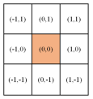
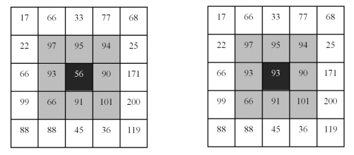
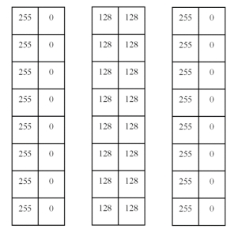

# 图像噪声

图像在采集和传输的过程当中必然会受到各种噪声在不同程度上的污染。根据图像和噪声之间的相互关系将噪声划分为以下三种形式：

## 图像和噪声的关系

### 加性噪声

噪声和原始图像不相关，可以表示为：
$$
f(x,y) = g(x,y)+n(x,y)
$$
其中$f(x,y)$代表被污染的图像（噪声图像），$g(x,y)$代表原始图像，$n(x,y)$代表噪声。图像中的加性噪声一般是在图像的传输过程中由“信道噪声”和CCD摄像机对图像数字化的过程中产生的。

### 乘性噪声

噪声和原始图像相关，可以表示为：
$$
f(x,y) = g(x,y) \times n(x,y)
$$
图像中的乘性噪声一般是由胶片中的颗粒、飞点扫描图像中的噪声、电视扫描光栅等原因造成的。

### 量化噪声

图像中的量化噪声是图像在量化过程中图像从模拟到数字所产生的差异，是图像量化过程中的误差。


## 概率分布的噪声

>提供一个加入噪声的方法：
>
>创建一个和原图一样的随机噪声数据矩阵，然后将原图像矩阵与噪声矩阵相加，然后做处理。
>
>有个问题，就是说在原图像中如果加入噪声数据后，其像素点的值大于255，那么加入噪声数据后的数值有两种处理方法：
>
>1. 将加入噪声后的数据按照比例缩放到[0, 255]的区间中（可通过cv2.normalize函数来实现）
>2. 加入噪声数据后，如果其值大于255，要么丢弃，要么就将其设置为255。（可通过numpy中的clip函数，即np.clip）

添加噪声也可使用封装好的函数库：`scikit-image`

安装：

```cmd
pip install scikit-image
```

使用：

```python
# 导包
import skimage
from skimage import util
```

```python
def random_noise(image, mode='gaussian', seed=None, clip=True, **kwargs):
功能：为浮点型图片添加各种随机噪声
参数：
image：输入图片（将会被转换成浮点型），ndarray型
mode： 可选择，str型，表示要添加的噪声类型
	gaussian：高斯噪声
	localvar：高斯分布的加性噪声，在“图像”的每个点处具有指定的局部方差。
	poisson：泊松再生
	salt：盐噪声，随机将像素值变成1
	pepper：椒噪声，随机将像素值变成0或-1，取决于矩阵的值是否带符号
	s&p：椒盐噪声
	speckle：均匀噪声（均值mean方差variance），out=image+n*image
seed： 可选的，int型，如果选择的话，在生成噪声前会先设置随机种子以避免伪随机
clip： 可选的，bool型，如果是True，在添加均值，泊松以及高斯噪声后，会将图片的数据裁剪到合适范围内。如果谁False，则输出矩阵的值可能会超出[-1,1]
mean： 可选的，float型，高斯噪声和均值噪声中的mean参数，默认值=0
var：  可选的，float型，高斯噪声和均值噪声中的方差，默认值=0.01（注：不是标准差）
local_vars：可选的，ndarry型，用于定义每个像素点的局部方差，在localvar中使用
amount： 可选的，float型，是椒盐噪声所占比例，默认值=0.05
salt_vs_pepper：可选的，float型，椒盐噪声中椒盐比例，值越大表示盐噪声越多，默认值=0.5，即椒盐等量
--------
返回值：ndarry型，且值在[0,1]或者[-1,1]之间，取决于是否是有符号数
```


### 高斯噪声（Gaussian noise）

高斯噪声的概率密度函数可以表示为：
$$
p(z)=\frac{1}{(\sqrt{2 \pi} \sigma)^{2}} e^{-(z-\mu)^{2} / 2 \sigma^{2}}
$$
期望值用$\mu$表示，标准差用$\sigma$表示。


```python
def gasuss_noise(image, mean=0, var=0.001):
    """
        添加高斯噪声
        mean : 均值
        var : 方差
    """
    image = np.array(image / 255, dtype=float)
    noise = np.random.normal(mean, var ** 0.5, image.shape)
    out = image + noise
    if out.min() < 0:
        low_clip = -1.
    else:
        low_clip = 0.
    out = np.clip(out, low_clip, 1.0)
    out = np.uint8(out * 255)
    return out
```

```python
img = cv2.imread("./raw.jpg")

# 创建方差为0，方差为1的高斯噪声
mu, sigma = 0, 1
noiseGause = np.random.normal(mu, sigma, img.shape)

imgGaussNoise = img + noiseGause
imgGaussNoise = np.uint8(cv2.normalize(imgGaussNoise, None, 0, 255, cv2.NORM_MINMAX))  # 归一化为 [0,255]
```


### 脉冲噪声(Impulsive noise)，椒盐噪声（Salt-pepper Noise）

脉冲噪声的概率密度函数为
$$
p(z)= \begin{cases}P s & , z=2^{k}-1 \\ P p & , z=0 \\ 1-(P s+P p) & , z=V\end{cases}
$$
当 Ps、Pp 都不为 0 时，噪声值是白色的 $\left(2^{k}-1\right)$ 或黑色的 $(0)$ ，就像盐粒或胡赦粒那样随机地分布在整个图像上，因此称为**椒盐噪声**，也称为双极冲击噪声。当 $P s$ 或 $P p$ 为 0 时，称为单极冲击橾声。
椒盐噪声的均值和标准差为:
$$
\begin{gathered}
\bar{z}=(0) P p+K(1-P s-P p)+\left(2^{k}-1\right) P s \\
\sigma^{2}=(0-\bar{z})^{2} P p+(K-\bar{z})^{2}(1-P s-P p)+\left(2^{k}-1\right)^{2} P s
\end{gathered}
$$
像素被白色盐粒、黑色胡椒粒污染的概率 $\mathrm{P}$ 称为噪声密度：
$$
P=P s+P p
$$
例如，Ps=0.05，Pp=0.02，则噪声密度 $P=0.07$ ，表示图像中约 $5 \%$ 的像素被盐粒唱声污染，约 $2 \%$ 的像素被胡椒粒橾声污染，噪声密度 为 $7 \%$ ，即图像中 $7 \%$ 的像素被椒盐噪声污染。


```python
 img = cv2.imread("./raw.jpg")

# 创建噪声
ps, pp = 0.05, 0.02
mask = np.random.choice((0, 0.5, 1), size=img.shape[:2], p=[pp, (1-ps-pp), ps])
imgChoiceNoise = img.copy()
imgChoiceNoise[mask==1] = 255 # 白色
imgChoiceNoise[mask==0] = 0	# 黑色
```


### 瑞利噪声(Rayleigh noise)

瑞利噪声的概率密度函数为
$$
p(z)= \begin{cases}{\frac{2}{b}} *(z-a) e^{-(z-a)^{2} / b} & , z \geq a \\ 0 & , z<a\end{cases}
$$
瑞利噪声的均值和标准差为:
$$
\begin{gathered}
\bar{z}=a+\sqrt{\pi b / 4} \\
\sigma^{2}=b(4-\pi) / 4
\end{gathered}
$$
瑞利噪声概率密度分布到原点的距离及密度的基本形状右偏，常用于倾斜形状直方图的建模。

```python
img = cv2.imread("./raw.jpg")

# 创建噪声
a = 3
noiseRayleigh = np.random.rayleigh(a, size=img.shape)

imgRayleighNoise = img + noiseRayleigh
imgRayleighNoise = np.uint8(cv2.normalize(imgRayleighNoise, None, 0, 255, cv2.NORM_MINMAX))  # 归一化为 [0,255]
```


### 伽马噪声(Gamma noise)

伽马噪声的概率密度函数可以表示为:
$$
p(z)= \begin{cases}\frac{a^{b} z^{b-1}}{(b-1) !} e^{-a z} & z \geq 0 \\ 0 & z<0\end{cases}
$$

```python
img = cv2.imread("./raw.jpg")

# 创建噪声
a, b = 10, 2
noiseGamma = np.random.gamma(shape=b, scale=a, size=img.shape)

imgGammaNoise = img + noiseGamma
imgGammaNoise = np.uint8(cv2.normalize(imgGammaNoise, None, 0, 255, cv2.NORM_MINMAX))  # 归一化为 [0,255]
```


### 指数噪声(Exponential noise)

指数噪声的概率密度函数为：
$$
p(z)= \begin{cases}a e^{-a z} & , z \geq 0 \\ 0 & , z<0\end{cases}
$$
指数噪声的均值和标准差为:
$$
\begin{aligned}
\bar{z} &=1 / a \\
\sigma^{2} &=1 / a^{2}
\end{aligned}
$$
显然，指数噪声是爱尔兰噪声在 $b=1$ 时的特殊情况。

```python
img = cv2.imread("./raw.jpg")

# 创建噪声
a = 10
noiseExponent = np.random.exponential(scale=a, size=img.shape)

imgExponentNoise = img + noiseExponent
imgExponentNoise = np.uint8(cv2.normalize(imgExponentNoise, None, 0, 255, cv2.NORM_MINMAX))  # 归一化为 [0,255]

```


### 均匀噪声(Uniform noise)

均匀噪声的概率密度函数为
$$
p(z)= \begin{cases}{\frac{1}{b-a}} & , a \leq z \leq b \\ 0 & , \text { other }\end{cases}
$$
均匀噪声的均值和标准差为:
$$
\begin{gathered}
\bar{z}=(a + b) / 2 \\
\sigma^{2}=(b-a)^{2} / 12
\end{gathered}
$$

```python
img = cv2.imread("./raw.jpg")

# 创建噪声
mean, sigma = 10, 100 # 设置均值和方差
# 根据均值和方差，反算出a和b的值
a = 2 * mean - np.sqrt(12 * sigma) 
b = 2 * mean + np.sqrt(12 * sigma) 
noiseUniform = np.random.uniform(a, b, img.shape)


imgUniformNoise = img + noiseUniform
imgUniformNoise = np.uint8(cv2.normalize(imgUniformNoise, None, 0, 255, cv2.NORM_MINMAX))  # 归一化为 [0,255]
```


# 图像滤波

## 原理

图像信息在采集过程中往往受到各种噪声源的干扰，这些噪声在图像上的常常表现为一些**孤立像素点**。噪点像素值与它们临近像素值有着显著的不同。

一般的前置图像处理后的图像仍然带有后续所不希望夹带的孤立像素点，这种干扰或孤立像素点如不经过滤波处理，会对以后的图像区域分割、分析和判断带来影响。

图像滤波，即在尽量保留图像细节特征的条件下对目标图像的噪声进行抑制，是图像预处理中不可缺少的操作，其处理效果的好坏将直接影响到后续图像处理和分析的有效性和可靠性。


线性空间滤波器在图像 $f$ 和滤波器核 $w$ 之间执行乘积之和运算。核是个阵列，其大小定义了运算的邻域，其系数决定了该滤波器的性质。


## 线性滤波

对邻域中的像素的计算为线性运算时，如利用窗口函数进行平滑加权求和的运算，或者某种卷积运算，都可以称为线性滤波。常见的线性滤波有：方框滤波、均值滤波、高斯滤波等等，通常线性滤波器之间只是模版的系数不同。

### 方框滤波

积分图：图像积分图中每个点的值是原图像中该点左上角的所有像素值之和。但是这种方法复杂度为$O(MN)$，其中 $M$ 和 $N$ 为图像的长宽像素。

方框滤波优势：计算的时间复杂度能够降低到$O(1)$ 或者接近 $O(1)$ 的复杂度。

方框滤波采用下面的卷积核与图像进行卷积：
$$
M=\left[\begin{array}{ccccc}
1 & 1 & \cdots & 1 & 1 \\
1 & 1 & \cdots & 1 & 1 \\
& & \cdots \cdots & & \\
1 & 1 & \cdots & 1 & 1
\end{array}\right]
$$

```python
# 方框滤波
import cv2
cv2.boxFilter(img, -1,(5,5),normalize=1)
```


### 均值滤波

均值滤波就是方框滤波归一化的特殊情况。使卷积核所有的元素之和等于1。卷积核如下：
$$
M=\frac {1}{\alpha}\left[\begin{array}{ccccc}
1 & 1 & \cdots & 1 & 1 \\
1 & 1 & \cdots & 1 & 1 \\
& & \cdots \cdots & & \\
1 & 1 & \cdots & 1 & 1
\end{array}\right]
$$
其中，$\alpha$ 为卷积核中点的个数。

> 均值滤波的缺点：均值滤波本身存在着固有的缺陷，即它不能很好地保护图像细节，在图像去噪的同时也破坏了图像的细节部分，从而使图像变得模糊，不能很好地去除噪声点。特别是椒盐噪声。

```python
# 均值滤波
import cv2
cv2.blur(img,(5,5))
```


### 高斯滤波

在进行均值滤波和方框滤波时，其邻域内每个像素的权重是相等的。在高斯滤波中，会将中心点的权重值加大，远离中心点的权重值减小，在此基础上计算邻域内各个像素值不同权重的和。在高斯滤波中，核的宽度和高度可以不相同，但是它们都必须是奇数。

高斯滤波和均值滤波一样，都是利用一个卷积核和图像进行卷积求解。不同之处在于：均值滤波器的模板系数都是相同的为1，而高斯滤波器的模板系数，则随着距离模板中心的增大而系数减小（服从二维高斯分布）。所以，高斯滤波器相比于均值滤波器对图像的模糊程度较小，更能够保持图像的整体细节。

二维高斯分布：
$$
f(x,y)=\frac{1}{(\sqrt{2 \pi} \sigma)^{2}} e^{-\left(\left(x-u_{x}\right)^{2}+\left(y-u_{y}\right)^{2}\right) / 2 \sigma^{2}}
$$

> 生成卷积核的具体过程如下：
>
> 不必纠结于系数，因为它只是一个常数，并不会影响互相之间的比例关系，并且最终都要进行归一化，所以在实际计算时我们忽略它而只计算后半部分。根据二维高斯分布公式，其中 $(x,y)$ 为卷积核内任一点的坐标， $(u_x,u_y)$ 为卷积核中心点的坐标，通常为$(0,0)$；$\sigma$ 是标准差。要产生一个 $3 \times 3$ 的高斯滤波器模板，以模板的中心位置为坐标原点。模板中各个位置的坐标，如下图所示：
>
> 
>
> 高斯分布的函数可以改为：
> $$
> f(x,y)=\frac{1}{(\sqrt{2 \pi} \sigma)^{2}} e^{-\left(x^{2}+y^{2}\right) / 2 \sigma^{2}}
> $$
> 然后，将各个位置的坐标 $(x,y)$ 带入到高斯函数中，得到的值就是模板的系数。

```python
# 高斯滤波
import cv2
cv2.GaussianBlur(img,(5,5),0,0)
```


## 非线性滤波

非线性滤波利用原始图像跟模版之间的一种逻辑关系得到结果，如最值滤波器，中值滤波器。比较常用的有中值滤波器和双边滤波器。

### 中值滤波

中值滤波不再采用加权求和的方式计算滤波结果，它用邻域内所有像素值的中间值来代替当前像素点的像素值。中值滤波会取当前像素点及其周围临近像素点的像素值，一般有奇数个像素点，将这些像素值排序，将排序后位于中间位置的像素值作为当前像素点的像素值。

中值滤波对于**斑点噪声（speckle noise）**和**椒盐噪声（salt-and-pepper noise）**来说尤其有用，几乎在不影响原有图像的情况下去除全部噪声。但是由于需要进行排序操作，中值滤波的计算量较大。中值滤波器在处理连续图像窗函数时与线性滤波器的工作方式类似，但滤波过程却不再是加权运算。

> 如下图：滤波核大小为$3$，邻域内的像素值排序后为 $[56,66,90,91,93,94,95,97,101]$，中值为$93$，所以用 $93$ 替换中心点原来的像素值 $56$。
>
> 

```python
# 中值滤波
import cv2
cv2.medianBlur(img, 5)
```


### 双边滤波

双边滤波是综合考虑空间信息和色彩信息的滤波方式，在滤波过程中能有效的保护图像内的边缘信息。双边滤波在计算某一个像素点的像素值时，同时考虑距离信息（距离越远，权重越小)和色彩信息（色彩差别越大，权重越小）。既能去除噪声，又能较好的保护边缘信息。

> 如下图：左边为原图，中间为均值滤波可能的结果，右边为双边滤波的结果：
>
> 
>
>  在**双边滤波**中，计算左侧白色$(255)$区域的滤波结果时：
>
> 1. 对于白色的点，权重较大
> 2. 对于黑色的点，与白色的色彩差别较大 $(0和255)$ ，所以可以将他们的权重设置为$0$
>
> 计算右侧黑色区域的滤波结果时：
>
> 1. 对于黑色的点，权重较大
> 2. 对于白色的点，与黑色的色彩差别较大$(0和255)$ ，所以可以将他们的权重设置为$0$
>
> 这样，左侧白色的滤波结果仍是白色，黑色的像素点权重为$0$，对它不会有影响；右侧黑色的滤波结果仍是黑色，白色的像素点权重为$0$，对它不会有影响。所以，双边滤波会将**边缘信息保留**

```python
# 双边滤波
import cv2
cv2.bilateralFilter(img, 25, 100, 100)
```


# 图像锐化

图像锐化，是使图像边缘更清晰的一种图像处理方法，常用的做法是提取图像的高频分量，将其叠加到原图上。图像高频分量的提取有两种做法，一种是用高通滤波器，得到高频分量，另一种是通过低通滤波，用原图减低频得以高频。


## Roberts算子

Roberts算子又称交叉微分算法，它是基于交叉差分的梯度算法，通过局部差分计算检测边缘线条，常来处理具有陡峭的低噪声图像，当图像边缘接近于正负45，处理效果最佳。缺点是对边缘定位信息不太准确，提取的边缘线条较粗。Roberts算子模板分为水平方向和垂直方向。其模板如下所示：
$$
d_{x}=\left[\begin{array}{cc}
-1 & 0 \\
0 & 1
\end{array}\right] \quad d_{y}=\left[\begin{array}{cc}
0 & -1 \\
1 & 0
\end{array}\right]
$$
然后使用该卷积核对推向进行卷积操作，可以提取相关的边缘信息。


## Prewitt算子

Prewitt算子是一种图像边缘检测的微分算子，由于Prewitt算子采用3*3模板对区域中的像素进行计算，而Roberts算子的是利用2*2模板，因此，Prewitt算子边缘检测结果在水平方向和垂直方向均比Roberts算子更加明显。Prewitt算子适合用来处理噪声较多，灰度渐变的图像。其计算公式如下：
$$
d_{x}=\left[\begin{array}{cc}
-1 & 0 & 1 \\
-1 & 0 & 1 \\
-1 & 0 & 1
\end{array}\right] \quad d_{y}=\left[\begin{array}{cc}
-1 & -1 & -1 \\
 0 & 0 & 0 \\
 1 & 1 & 1
\end{array}\right]
$$
Prewitt算子在一个方向求微分，而在另一个方向求平均，因而对噪声相对不敏感，有抑制噪声作用。但是像素平均相当于对图像的低通滤波，所以Prewitt算子对边缘的定位不如Roberts算子。


## Sobel算子

Sobel 算子是一种离散的微分算子，是高斯平滑和微分求导的联合运算，抗噪声能力强。

Sobel 梯度算子利用局部差分寻找边缘，计算得到梯度的近似值。先计算水平、垂直方向的梯度 $G_{x}=d_{x} * img ， G_{y}=d_{y} * img$ ，再求总梯度$G = \sqrt{G_x^2+G_y^2}$ 编程实现时，可以用绝对值近似平方根: $G=\left|G_{x}\right|+\left|G_{y}\right|_{\text {。 }}$

Sobel 梯度算子是由平滑算子和差分算子卷积得到，Sobel 梯度算子的卷积核为:
$$
K_{x}=\left[\begin{array}{ccc}
-1 & 0 & 1 \\
-2 & 0 & 2 \\
-1 & 0 & 1
\end{array}\right], K_{y}=\left[\begin{array}{ccc}
-1 & -2 & -1 \\
0 & 0 & 0 \\
1 & 2 & 1
\end{array}\right]
$$


## Laplacian算子

各向同性卷积核的响应与方向无关。最简单的各向同性导数算子 (卷积核) 是拉普拉斯算子 (Laplace) :
$$
\begin{aligned}
\nabla^{2} f &=\frac{\partial^{2} f}{\partial x^{2}}+\frac{\partial^{2} f}{\partial y^{2}} \\
\frac{\partial^{2} f}{\partial x^{2}} &=f(x+1, y)-2 f(x, y)+f(x-1, y) \\
\frac{\partial^{2} f}{\partial y^{2}} &=f(x, y+1)-2 f(x, y)+f(x, y-1) \\
\nabla^{2} f(x, y) &=f(x+1, y)+f(x-1, y)+f(x, y+1)+f(x, y-1)-4 f(x, y)
\end{aligned}
$$
由此可以得到拉普拉斯核 $\mathrm{K} 1$ 。类似地，考虑对角项后可以得到拉普拉斯核 $\mathrm{K} 2$。
$$
K 1=\left[\begin{array}{ccc}
0 & 1 & 0 \\
1 & -4 & 1 \\
0 & 1 & 0
\end{array}\right], K 2=\left[\begin{array}{ccc}
1 & 1 & 1 \\
1 & -8 & 1 \\
1 & 1 & 1
\end{array}\right], K 3=\left[\begin{array}{ccc}
0 & -1 & 0 \\
-1 & 4 & -1 \\
0 & -1 & 0
\end{array}\right], K 4=\left[\begin{array}{ccc}
-1 & -1 & -1 \\
-1 & 8 & -1 \\
-1 & -1 & -1
\end{array}\right]
$$
Laplace 是导数算子，会突出图像中的急剧灰度变化，抑制灰度缓慢变化区域，往往佘产生暗色背景下的灰色边缘和不连续图像。将拉普拉斯图像与原图叠加，可以得到保留锐化效果的图像。

